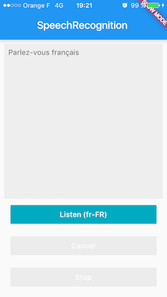

# speech_recognition

A flutter plugin to use the speech recognition iOS10+ / Android 4.1+



## Usage

```dart
//..
_speech = new SpeechRecognition();

// The flutter app not only call methods on the host platform,
// it also needs to receive method calls from host.
_speech.setAvailabilityHandler((bool result) 
  => setState(() => _speechRecognitionAvailable = result));

// handle device current locale detection
_speech.setCurrentLocaleHandler((String locale) =>
 setState(() => _currentLocale = locale));

_speech.setRecognitionStartedHandler(() 
  => setState(() => _isListening = true));

// this handler will be called during recognition. 
// iOs allow to send the intermediate results,
// On my Android device, only the final transcription is received
_speech.setRecognitionResultHandler((String text) 
  => setState(() => transcription = text));

_speech.setRecognitionCompleteHandler(() 
  => setState(() => _isListening = false));

// 1st launch : speech recognition permission / initialization
_speech
    .activate()
    .then((res) => setState(() => _speechRecognitionAvailable = res));
//..

speech.listen(locale:_currentLocale).then((result)=> print('result : $result'));

// ...

speech.cancel();

// ||

speech.stop();

```


## Permissions

### iOS

infos.plist, add :
- Privacy - Microphone Usage Description
- Privacy - Speech Recognition Usage Description

```xml
<key>NSMicrophoneUsageDescription</key>
<string>This application needs to access your microphone</string>
<key>NSSpeechRecognitionUsageDescription</key>
<string>This application needs the speech recognition permission</string>
```

### Android

```xml
<uses-permission android:name="android.permission.RECORD_AUDIO" />
```

## Limitation

## Getting Started

For help getting started with Flutter, view our online
[documentation](http://flutter.io/).

For help on editing plugin code, view the [documentation](https://flutter.io/platform-plugins/#edit-code).